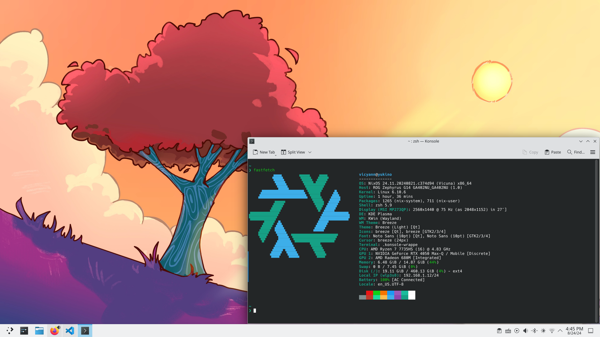

<h1 align="center" > Nix-Config</h1>

<p align="center">
  
</p>
This repository stored the Nix code that I use to build my systems. Currently, I am using NixOS with KDE Plasma and home-manager,...

Details of each host:
- `yukino`: NixOS on Zephyrus G14 with Ryzen 7 7735HS + RTX 4050 , 16GB RAM + 512GB SSD
- `kanade`: NixOS on WSL2

>These are the configurations of my systems, maybe it doesn't suitable for your hardware. You may use this repository as a reference to build your configuration.



<h2> File Structure</h2>

```
Wallpapers      # wallpapers
│
home-manager    # contain user's config
│   home.nix    # import all submodules       
│w
│───desktop     # desktop configuration
│
│───shell       # shell configuration
│ 
│───utilities   # utilities(fastfetch,...) configuration
│       
host   
│ 
│───yukino   # yukino's configuration
│ 
│───kanade   # kanade's configuration
│ 
modules    # some common NixOS modules that can be reused
│   nvidia.nix    # nvidia's driver configuration       
│   system.nix    
│
nix-dev
│   flake.nix   # dev environment configuration
│   flake.lock
│
flake.nix
flake.lock
```

